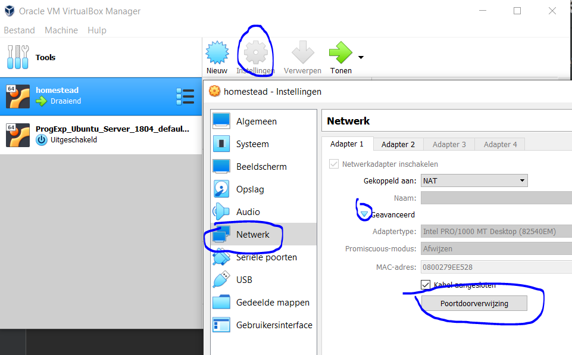
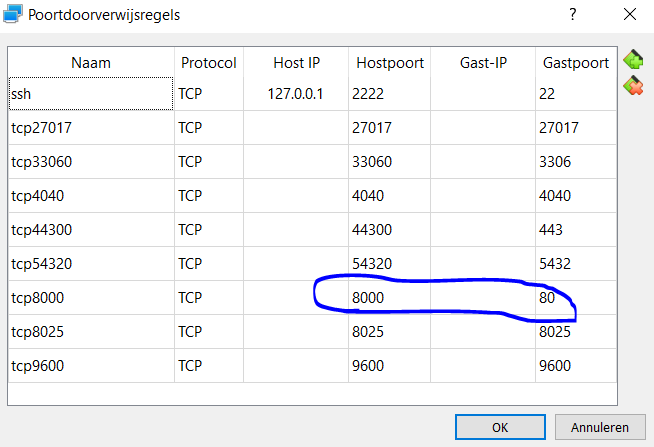

# PE Web & Mobile: React-Native

## Setup

### 1. Make sure REST API is up and running

### 2. Make sure port forwarding is set up

We run Symfony 4.3 on Laravel Homestead in a Virtualbox environment. To make sure your Virtualbox port forwarding 
settings are correct, open Virtualbox, navigate to your running virtual machine enabling your REST API, and click on
setting, next on network, and finally on port forwarding: 

Next, make sure the port on your host machine for forwarding requests to the virtual machine's HTTP port 80 is set to 
8000:

### 3. Run 'npm install' in the React Native project root folder

### 4. Run 'npm run android'

That way, requests to localhost:8000 on your Android device are reverse proxy'd to port 8000 on your host machine. 
Taking the port forwarding by Virtualbox into account, the localhost:8000 API calls on the React Native app will be 
sent from port 8000 on the host machine to port 80 on the virtual machine.

### 5. Add your Google API key in env.tsx
